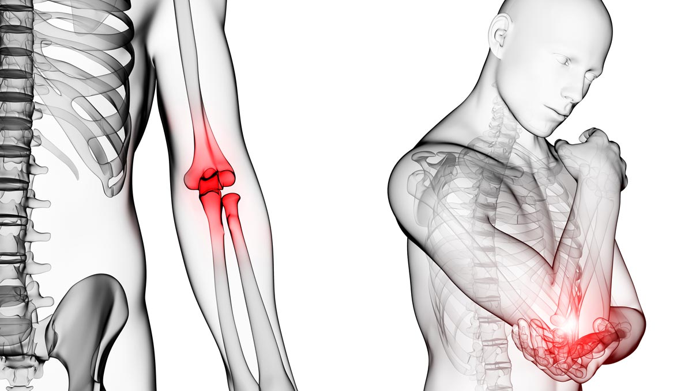

```{r setup, include=FALSE}
knitr::opts_chunk$set(echo = TRUE)
```

# **Introducción**
El desarrollo de enfermedades laborales pueden ocasionar bajas laborales. Estas enfermedades se producen en el ámbito laboral según el trabajo realizado, hemos querido estudiar como el desarrollo de estas enfermedades se puede agravar por poseer una enfermedad mental, incluso si la gravedad de la enfermedad laboral es distinta entre géneros o debido a la profesión realizada.

# **Objetivo general**
Evaluación del desarrollo de enfermedades laborales, respecto a la profesión y el estado de salud mental.

# **Objetivo específico**
- ¿Existe relación entre la profesión de movimiento de tierra respecto al desarrollo de enfermedades psicológicas?
- ¿Existe relación entre el desarrollo de enfermedades laborales respecto al sexo?
- ¿Existe relación entre la gravedad de una enfermedad psicológica respecto al desarrollo de una enfermedad laboral?


# **Relación con otros artículos y estudios**
Uno de ellos tambien estudia la incidencia de enfermedades según la economía y el sexo de los encuestados.
Segun el sexo hay diferencias significativas donde los hombres tienen mayor numero de enfermedades, ya que son estos los que ocupan los trabajos fisicos exigentes. En cuanto al tipo de trabajo el sector de la mineria, construcción y agricultura resultan los que mas enfermedades se tienen.

Otro articulo que nos ha resultado interesante es el siguiente: en Reino Unido se estudio que el personal de construccion tiene mas probabilidad de suicidarse que el promedio nacional. Según los redactores comentan que se debe a que los trabajadores no quieren buscar ayuda terapeutica, y los contratos de largas jornadas y lejos de la familia tampoco ayudan. Por ello determinan que concienciar sobre este problema y quitar el estigma es importante.

# **Metodología**
## **Materiales**
Agregamos los URL de la base de datos `datos.gob.es` donde se obtienen los datos para el posterior estudio:

- [Enfermedades laborales](https://datos.gob.es/es/catalogo/ea0010587-personas-de-16-a-74-ocupadas-anos-o-que-trabajaron-anteriormente-que-hayan-tenido-alguna-enfermedadlaboral-por-tipo-de-enfermedad-y-sexo-epa-identificador-api-t22-e308-meto_05-modulo-base_2011-2020-l0-02003-px1)

- [Estado de salud mental](https://datos.gob.es/es/catalogo/a05003423-poblacion-de-16-y-mas-anos-segun-autovaloracion-del-estado-de-salud-en-relacion-a-situaciones-de-ansiedad-o-depresion-sexos-o-grupos-de-edad-por-anos-canarias-2004-2009)

- [Tipos de trabajos](https://datos.gob.es/es/catalogo/a05003423-accidentes-de-trabajo-en-jornada-segun-tipos-de-trabajo-gravedad-trabajo-habitual-o-no-y-sexos-canarias-y-anos)

- [Grado de lesión de la enfermedad laboral](https://datos.gob.es/es/catalogo/a02002834-accidentes-en-jornada-de-trabajo-n-de-accidentes-segun-grado-de-lesion-y-sexo)

Agregamos el URL del repositorio:
- [Repositorio](https://github.com/Lucia-G-R/Seminario_Fuentes.git)

### **Carga de paquetes**
En este apartado vamos a indicar y cargar los paquetes necesarios para el desarrollo de nuestra práctica.

- Paquete necesario para exportar el conjunto de datos en formato .JSON.
```{r, warning=FALSE}
#install.packages("tidyjson")
```
- Paquete necesario para exportar los conjuntos de datos en formato .xls y .xlsx.
```{r, warning=FALSE}
#install.packages("readxl")
```
- Paquete necesario para exportar el conjunto de datos en formato .csv.
```{r, warning=FALSE}
#install.packages("readr")
```
- Paquete necesario para poder realizar la manipulación de dataframes.
```{r, warning=FALSE}
#install.packages("dplyr") 
```
- Paquete necesario para transformar las filas y columnas.
```{r, warning=FALSE}
#install.packages("tidyverse")
```
- Paquete para poder mostrar las tablas formatedas.
```{r, warning=FALSE}
#install.packages("DT")
```
- Paquete necesario para la implementación de gráficos.
```{r}
#install.packages("ggplot2")
```

## **Carga de datos**
### **Descargar datos**
Aunque a lo largo de este seminario utilizamos los archivos que hemos importado en una carpeta INPUT. Se podrían obtener estos archivos mediante su descarga. Por ejemplo, descargamos los datos de la población de 16 y más años según autovaloración del estado de salud en relación a situaciones de ansiedad o depresión, sexos o grupos de edad por años en Canarias en formato ".csv" de la página web de la base de datos del gobierno de España:
```{r, eval=FALSE, warning=FALSE}
library(readxl)

# URL del archivo Excel en GitHub
url <- "https://github.com/Lucia-G-R/Seminario_Fuentes/blob/main/INPUT/DATA/Enfermedades_laborales_Espa%C3%B1a.csv.csv"

# Creamos un archivo temporal para almacenar el Excel
temp <- tempfile(fileext = ".csv")

# Descargamos el archivo desde la base de datos
download.file("https://datos.gob.es/es/catalogo/a05003423-poblacion-de-16-y-mas-anos-segun-autovaloracion-del-estado-de-salud-en-relacion-a-situaciones-de-ansiedad-o-depresion-sexos-o-grupos-de-edad-por-anos-canarias-2004-2009", destfile = temp, mode = "wb")
```

### **Carga de datos JSON**
En primer lugar, queremos extraer los datos sobre las enfermedades laborales que suceden en España. 
Como es un archivo con extensión .JSON con listas anidadas, no podemos utilizar directamente un tibble . 
Para ello, debemos de convertir las listas anidadas, en este caso la lista MetaData y la lista Data, en dataframes. Finalemente, unimos ambos dataframes anteriores junto con el resto de columnas del archivo .JSON que no son listas anidadas.
``` {r load-packages, message=FALSE, warning=FALSE}
library(rjson)
library(tidyverse)
library(tidyjson)
library(dplyr)
library(DT)

# Cargamos el archivo con extensión .JSON.
espana_json <- fromJSON(file = "INPUT/DATA/Enfermedades_laborales_España.json")

# Observamos la estructura, nos damos cuenta que posee listas anidadas
#str(espana_json)

# Convertimos la lista de la variable MetaData en un dataframe
MetaData_df<-
  espana_json%>%
  enter_object("MetaData")%>% # Extraemos la información dentro de "MetaData"
  gather_array() %>% # Convertimos los elementos de un array en filas
  spread_all()%>% # Esta función distribuye cualquier objeto JSON que sea escalar en nuevas columnas
  select(T3_Variable, Nombre, Codigo) # Seleccionamos las tres variables que posee 

# Convertimos la lista de la variable Data en un dataframe
Data_df<-
  espana_json%>%
  enter_object("Data")%>% # Extraemos la información dentro de "Data"
  gather_array() %>% 
  spread_all()%>%
  select(Valor) # Seleccionamos la variable que posee 

# Unimos MetaData_df y Data_df usando "..JSON". Extraemos la columna "..JSON" como identificador 
# Expandimos la columna "..JSON" con prefijo para evitar conflictos de nombres.
MetaData_df <- 
  MetaData_df %>%
  unnest_wider(..JSON, names_sep = "_json")

Data_df <- 
  Data_df %>%
  unnest_wider(..JSON, names_sep = "_json")

# Creamos un identificador único para cada fila
MetaData_df <- 
  MetaData_df %>%
  mutate(id = row_number())

Data_df <- 
  Data_df %>%
  mutate(id = row_number())

# Hacemos la unión de los data frames por la columna id que hemos creado con la variable lista "..JSON"
espana_df <- 
  MetaData_df %>%
  left_join(Data_df, by = "id") %>% # Unimos con Data_df usando 'id'
  mutate(Nombre = espana_json$Nombre) # Agregamos la columna "Nombre" del espana_json

datatable(espana_df)
```

### **Carga de datos XLS**
En segundo lugar, queremos extraer los datos sobre los accidentes laborales que suceden en Canarias. 
Como es un archivo con extensión .xls, utilizamos read_excel.
```{r, warning=FALSE}
library(readxl)
library(DT)

# Cargamos el archivo con extensión .xls
canarias_df <- read_excel("INPUT/DATA/Accidentes_laborales_Canarias.xls")

datatable(canarias_df)
```

### **Carga de datos CSV**
En tercer lugar, queremos extraer los datos sobre la salud mental en los habitantes de Canarias. 
Como es un archivo con extensión .csv, utilizamos read_delim e indicamos que el delimitador es ;

Al imprimirlo como tabla con la función datatable nos da un error con el formato, es decir, indica que hay un problema con la codificación del archivo CSV. En este caso, el error nos indica que los archivos están codificados en UTF-8, pero revisando la tabla incluye caracteres como acentos. Por eso, utilizamos locale, siendo una forma de configurar la codificación de caracteres que define cómo se representan los caracteres de texto en bytes.

En conclusión con encoding = "ISO-8859-1" queremos que R interprete el archivo usando la codificación Latin-1, esta configuración asegura que los caracteres especiales se lean e interpreten de forma adecuada, evitando caracteres raros.
```{r, warning=FALSE}
library(readr)
library(DT)

# Cargamos el archivo con extensión .csv
Salud_df <- read_delim ("INPUT/DATA/Estados_de_salud_Canarias.csv.csv", delim = ";", locale = locale(encoding = "ISO-8859-1"), show_col_types = FALSE)

datatable(Salud_df)
```

### **Carga de datos XLSX**
Queremos extraer los datos sobre la gravedad de las enfermedades laborales producidas en Aragón. 
Como es un archivo con extensión .xlsx, utilizamos read_excel.
```{r cargar-datos-aragon, warning=FALSE, message=FALSE}
# Cargamos los archivos con extensión .xlsx
library(readxl)
library(DT)

Aragon_df <- read_excel ("INPUT/DATA/070901-02_Por grado y sexo. Aragon.xlsx")

datatable(Aragon_df)
```

## **Trabajar con columnas**
### **Observar valores nulos**
Observamos los valores nulos del conjunto de datos sobre los accidentes laborales que suceden en Canarias. Con select observamos las columnas que poseen valores nulos..
```{r, warning=FALSE, results="hide"}
# Observamos que columnas tienen valores nulos con la función "select".
library(dplyr)

canarias_df %>%
select(where(~ all(is.na(.))))
```

### **Cambiar nombre de las columnas**
Vamos a cambiar los nombres de las distintas columnas de los datos extraídos.
Cambiamos los nombres de las columnas del conjunto de datos sobre los accidentes laborales que suceden en Canarias.
Este renombre se realiza debido a tener mayor claridad a la hora de hacer un join sobre dos dataframes.
```{r, warning=FALSE}
# Renombre las columnas del dataframe Canarias
library(tidyverse)
library(DT)

canarias <- rename(.data = canarias_df, Año = `TIME_PERIOD#es`, Año2 = `TIME_PERIOD_CODE`, Sexo = `SEXO#es`, SexoCod = `SEXO_CODE`, Gravedad = `ACCIDENTE_GRAVEDAD#es`, GravedadCod = `ACCIDENTE_GRAVEDAD_CODE`, TipoTrab = `TIPO_TRABAJO#es`, TipoTrabCod = `TIPO_TRABAJO_CODE`, TrabHabitual = `TRABAJO_HABITUAL#es`, TrabHabCod = `TRABAJO_HABITUAL_CODE`, Obs = `OBS_VALUE`, ConfeciObs = `CONFIDENCIALIDAD_OBSERVACION#es`, Notasobs = `NOTAS_OBSERVACION#es`, Estadosobs = `ESTADO_OBSERVACION#es`)

datatable(canarias)
```
Cambiamos los nombres de las columnas del conjunto de datos sobre la gravedad de las enfermedades laborales producidas en Aragón. 
```{r, warning=FALSE}
# Renombre las columnas del dataframe Aragón
library(tidyverse)
library(DT)

Aragon <- rename(.data = Aragon_df, NumAcci = `Nº Accidentes`, Gravedad = `Grupo Grado Código...4`, GravedadCod = `Grupo Grado Código...5`)

datatable(Aragon)
```

Cambiamos los nombres de las columnas del conjunto de datos sobre las enfermedades laborales que suceden en España. 
```{r, warning=FALSE}
# Renombre las columnas del dataframe Enf. Laborales de España
library(tidyverse)
library(DT)

Espana <- rename(.data = espana_df, TipoEnf = `T3_Variable`, Indicador = `Codigo`, Variable = `..JSON_jsonT3_Variable`, Nombre = `..JSON_jsonNombre`, Codigo = `..JSON_jsonCodigo`, jsonValor = `..JSON_jsonValor`)

datatable(Espana)
```
Cambiamos los nombres de las columnas del conjunto de datos sobre la salud mental en los habitantes de Canarias.
```{r, warning=FALSE}
# Renombre las columnas del dataframe habitantes Canarias
library(tidyverse)
library(DT)

Salud <- rename(.data = Salud_df, Sexo = `sexos_grupos_edad`, EstadoAnsiedad = `autovaloracion_estado_salud_relacion_situaciones_ansiedad`, Años = `anios`, Obs = `poblacion_16_mas_anios`)

datatable(Salud)
```

### **Eliminar columnas**
Eliminamos las columnas que no nos va a interesar estudiar para ello, seleccionamos las columnas que nos interesan. 
En el único conjunto de datos que no vamos a eliminar columnas es en los datos sobre la salud mental en los habitantes de Canarias.
Primero vamos a eliminar las columnas del conjunto de datos de Canarias. Nos vamos a quedar solo con las columnas Año, Sexo, Gravedad, TipoTrab y Obs.
```{r, warning=FALSE} 
# Selección de las columnas con las que nos interesa trabajar posteriormente. 
# (Estamos trabajando con el dataframe Canarias)
library(dplyr)

canarias <- 
  canarias%>% 
  select(Año, Sexo, Gravedad, TipoTrab, Obs)
datatable(canarias)
```
En segundo lugar, eiminamos las columnas del conjunto de datos de Aragon. Nos vamos a quedar solo con las columnas Año, Sexo, NumAcci y Gravedad.
```{r, warning=FALSE} 
# Selección de las columnas con las que nos interesa trabajar posteriormente. 
# (Estamos trabajando con el dataframe Aragon)
library(dplyr)

Aragon <- 
  Aragon%>%
  select(Año, Sexo, NumAcci, Gravedad)
datatable(Aragon)
```
En tercer lugar, eliminamos las columnas del conjunto de datos de Espana. Nos vamos a quedar solo con las columnas Nombre, id y Valor.
```{r, warning=FALSE} 
# Selección de las columnas con las que nos interesa trabajar posteriormente. 
# (Estamos trabajando con el dataframe España)
library(dplyr)

Espana <- 
  Espana%>%
  select(Nombre, id, Valor)
datatable(Espana)
```

### **Case_when**
Vamos a utilizar las columnas Año, Sexo, Gravedad y Obs para que en una nueva columna Categoria sea más diferenciada y representativa.
Para ello, vamos a categorizar el nivel de gravedad según el número de accidentes. 
- Si la Gravedad es Total y las Obs mayorores que 5000 vamos a categorizarlo como Alta gravedad. 
- Si la Gravedad es Total, pero las Obs son menores o iguales que 5000 vamos a categorizarlo como Baja gravedad.
- También vamos a diferenciar las Obs de accidentes laborales por Sexo. Realizamos cuatro categorías dos si el Sexo es Mujer diferenciaremos entre Alta gravedad o Baja gravedad y lo mismo si el Sexo es Hombre. 
- Si el Sexo son los dos sexos juntos, es decir, Total se categoriza como Otro. Esta última condición succede cuando ninguna condición anterior cumple con los requisitos.
```{r, warning=FALSE}
# Introducción de dos nuevas columnas donde en ambas hay dos variables categorizadas (alto y bajo), y en una de ellas diferenciada por el sexo
library("DT")

canarias_when <- 
  canarias %>%
  mutate(Categoria = case_when(
    
# Nombramiento de una de las columnas en función de la gravedad y el número de observaciones (casos)    
    Gravedad == "Total" & Obs > 5000 ~ "Alta gravedad",
    Gravedad == "Total" & Obs <= 5000 ~ "Baja gravedad",

#  Nombramiento de la segunda columna en función del sexo y el número de observaciones  
    Sexo == "Mujeres" & Obs > 1000 ~ "Accidentes Mujeres - Alto",
    Sexo == "Hombres" & Obs > 1000 ~ "Accidentes Hombres - Alto",
    
    Sexo == "Mujeres" & Obs <= 1000 ~ "Accidentes Mujeres - Bajo",
    Sexo == "Hombres" & Obs <= 1000 ~ "Accidentes Hombres - Bajo",
    
    .default = "Otro"
  ))

datatable(canarias_when)
```

### **Añadir columnas**
Utilizamos mutate para sacar el porcentaje que representa cada observación respecto al conjunto de observaciones del conjunto de datos de canarias.
Con options(scipen=999) evitamos la notación científica.
```{r, warning=FALSE}
#Porcentaje de cada observación según el conjunto de observaciones del dataframe Canarias
library(dplyr)
library(DT)

options(scipen = 999) 
datatable(mutate(.data = canarias, Porcentaje_Obs = (Obs / sum(Obs)) * 100))
```
Observamos que existen valore nulos en la variable Valor del dataframe de España, por lo que para poder utilizar el mutate necesitamos eliminar aquellos valores vacíos. 
En primer lugar, nos quedamos solo con los valores distintos de nulos, es decir, los valores de nuestro interés.
En segundo lugar, utilizamos mutate para crear una nueva columna denominada Porcentaje_Valor que recoge el porcentaje que representa cada observación respecto al conjunto de observaciones del conjunto de datos de España denominado Espana.
Con options(scipen=999) evitamos la notación científica.
```{r, warning=FALSE}
#Se eliminan filas con valores nulos y se crea una nueva columna para saber el porcentaje de cada observacion segun las observaciones totales
library(dplyr)
library(DT)

Espana <- 
  Espana %>%
  filter(!is.na(Valor))

options(scipen = 999)
datatable(mutate(.data = Espana, Porcentaje_Valor = (Valor / sum(Valor)) * 100))
```

## **Realizar un dataframe conjunto**
Realizamos un dataframe uniendo los datos sobre la gravedad de las enfermedades laborales en Aragón y la salud mental de los ciudadanos en Canarias.
```{r, warning=FALSE}
#Unión del dataframe Aragón y Salud por las claves (columnas) "Sexo"
library(DT)

# Unimos por una columna común "Sexo"
df_Salu_Arag <- merge(Aragon, Salud, by = "Sexo")

datatable(df_Salu_Arag)
```

Realizamos un dataframe uniendo los datos sobre los accidentes laborales que suceden en Canarias y los datos sobre las enfermedades mentales.
```{r,  warning=FALSE}
#Unión de los dataframe Canarias y Salud por la clave "Año" y "Años". También se eliminan las filas duplicadas
library(DT)

canarias_dis <-
  canarias %>%
  distinct(Año, .keep_all = TRUE)

Salud_dis <-
  Salud %>%
  distinct(Años, .keep_all = TRUE)

df_cana_Salud <- 
  canarias_dis %>%
  inner_join(Salud_dis, by = c("Año" = "Años"))

datatable(df_cana_Salud)
```

## **Pivotar**
Vamos a transponer la estructura de nuestra tabla ordenada España de la columna Nombre desde largo a ancho, es decir, los Valores presentes en la columna Espana pasan a formar tres columnas.
```{r, warning=FALSE}
#Tranformación de la tabladesde largo a ancho
Long_Espana <- pivot_wider(data = Espana, names_from = "Nombre", values_from = "Valor")

datatable(Long_Espana)
```

## **Trabajar con filas**
### **Eliminar filas**
Eliminamos las filas que no nos va a interesar estudiar.
```{r, warning=FALSE, error = TRUE}
#eliminación de las filas que contengan un valor que no interese
Salud <- subset(Salud, !Sexo %in% c("De 16 a 64 a\xf1os", "De 65 y m\xe1s a\xf1os"))

```

### **Slices**
#### **Slices_head**
Seleccionamos las primeras 5 filas del conjunto de datos Salud que contiene los estados de ansiedad.
```{r, warning=FALSE}
#Observación de las 5 primeras filas del dataframe Salud
library("DT")

datatable(slice_head(.data = Salud, n =5))
```
#### **Slice_tail**
Seleccionamos las últimas 5 filas del conjunto de datos de Aragón que contiene el número de accidentes por años.
```{r, warning=FALSE}
# Observación de las 5 últimas filas del dataframe Aragón
library("DT")

datatable(slice_tail(.data = Aragon, n =5))
```
#### **Slice_sample**
Escogemos un conjunto de filas, exactamente 10 filas aleatorias del conjunto de datos de Long_Espana en el cual hemos pivotado los valores de una columna a formar tres columnas distintas.
```{r, warning=FALSE}
#Observación de 10 filas aleatorias del dataframe España (una vez pivotado)
library("DT")

datatable(slice_sample(.data = Long_Espana, n = 10))
```
#### **Slice_max**
Seleccionamos las filas que contengan los valores más altos de una columna específica, en este caso Año

```{r, warning=FALSE}
#Selección de valores mas altos según la columna Año
library("DT")

datatable(slice_max(.data = canarias, order_by = Año))
```
### **Arrange**
Ordena las filas de manera descendente según los niveles de gravedad de accidentes del conjunto de datos de Aragón.
```{r, warning=FALSE}
#Ordenación de las filas de la columna Gravedad (dt:Aragon) de fomra descendente
library("DT")

datatable(arrange(.data = Aragon, desc(factor(Gravedad)), NumAcci))
```

### **Summarise**
Calculamos el número total, las observaciones son los registros , el mínimo, el máximo y la mediana de accidentes laborales en los Años 2004 y 2009 con el dataframe conjunto del conjunto de datos de salud mental y el número de accidentes labotrales.
```{r, warning=FALSE}
# sumatorio total de las columnas en los años 2004 y 2009  del dt combinado Aragon y Salud
info_acci<- 
  df_Salu_Arag%>%
  group_by(Años)%>%
  summarise(
    Acci_total = sum(NumAcci),
    Acci_Obs = n(),
    Min_Aci = min(NumAcci),
    Max_Aci = max(NumAcci),
    Mediana_Aci = median(NumAcci)
    )

datatable(info_acci)
```


### **Tapply**
En este apartado vamos a realizar diferentes funciones con tapply para poder hallar el número de accidentes u obserrvaciones según el año, el sexo por tipo de trabajo.
Con esta función pretendemos hallar el total de accidentes que existen en cada una de las profesiones presentes en nuestro conjunto de datos de Canarias.
```{r, warning = FALSE}
# Identificación del total de accidentes según la profesión o tipo de trabajo
library("DT")

acci_trab <- tapply(canarias$Obs, canarias$TipoTrab, sum, na.rm = TRUE)

acci_trab_df <- data.frame(
  TipoTrab = names(acci_trab),
  TotalAcci = as.numeric(acci_trab)
)

datatable(acci_trab_df)
```

Con esta función pretendemos hallar la media de accidentes que existen según el sexo, además de la gravedad de estos que se  encuentran en nuestro conjunto de datos de Canarias.
```{r, warning=FALSE}
# Cálculo de la media de los accidentes según el género y la gravedad de estos
library("DT")

sexo_gravedad <- tapply(canarias$Obs, list(canarias$Sexo, canarias$Gravedad), mean, nar.rm = TRUE)

datatable(sexo_gravedad)
```

Con esta función pretendemos hallar el total de accidentes que existen en cada una de las profesiones a lo largo de los años presentes en nuestro conjunto de datos de Canarias.

```{r, warning=FALSE}
# Conteo por años de las diferentes profesiones 
library("DT")

año_trabajo <- tapply(canarias$Obs, list(canarias$Año, canarias$TipoTrab), sum, na.rm = TRUE)

datatable(año_trabajo)
```

## **Funciones**

Calcula de la media y el porcentaje de personas evaluadas
En 2021 el numero de habitantes en Aragón fue de 1331938 , en 2011 hubo 1344501 personas y en 2001, 1204215.
Se ha calculado la media de la población censada y se ha determinado el porcentaje de personas que se evaluaron según la población total.
Cantidad de hombres y mujeres del dataframe

```{r, warning=FALSE}
# Sumatorio de los generos del dt combinado Salud y Aragón.
# Calculo del porcentaje de encuentados según la población media en Aragón entre 2001 y 2021

hombres <- sum(df_Salu_Arag$Sexo == "Hombres")
mujeres <- sum(df_Salu_Arag$Sexo == "Mujeres")

print(paste("La cantidad de hombres y mujeres en el dataframe es", hombres, "y", mujeres, "respectivamente"))

suma_arag <- sum(hombres, mujeres)

"2021" <- 1331938
"2011" <- 1344501
"2001" <- 1204215

años <- c(`2021`, `2011`, `2001`)

media <- mean(años)

print(paste("La media de los habitantes en Aragón entre 2001 y 2021 es", media))

porcentaje <- (suma_arag / media) * 100

print(paste("El porcentaje de personas que han participado en la evaluación de accidentes laborales y sus consecuencias es", porcentaje,"%"))
```


## **Gráficos**
Este gráfico muestra el numero de accidentes en el mundo de la construcción separados por sexos y según la gravedad del accidente.
Podemos observar que en hombres hay mas accidentes que en el sexo contrario y en ambos casos estos son de gravedad leve.
```{r}
# Observación del gráfico entre mujeres y hombres según la gravedad  y el número de accidentes
library(ggplot2)
library(dplyr)

# Filtramos y agrupamos por sexo y gravedad
df_resultado <- df_Salu_Arag %>%
  filter(Gravedad == "Leves" | 
         Gravedad == "Mortales" | 
        Gravedad == "Graves o muy graves") %>%
  group_by(Sexo, Gravedad, NumAcci) %>%
  summarise(casos = n(), .groups = 'drop')

grafico_f1 <- ggplot(df_resultado, aes(x = Gravedad, y = NumAcci, fill = Sexo)) + 
  geom_bar(stat = "identity", position = "dodge") +
  labs(x = 'Gravedad accidentes', 
       y = 'Numero de casos', 
       title = 'Numero de accidentes según la gravedad y separados por sexos ',
       fill = 'Sexo') + 
  facet_wrap(~Sexo) 
print (grafico_f1)
```
Este gráfico muestra la diferencia de casos de ansiedad en mujeres y el tipo de ansiedad.
Hemos querido eliminar los indiviudos que no saben (o no contesta) o total ya que no daban información de valor y nos hemos quedado con la que realmente proporcionaba alguna conclusión. 
```{r}
# Observación del gráfico del género Mujeres según el grado de ansiedad y el numero de personas que la padecen
# Se ha eliminado las filas donde se queria prescindir de la información
mod_dt <- df_Salu_Arag %>%
  filter(!(Sexo %in% c("Hombres")), !(EstadoAnsiedad %in% c("No sabe/No contesta", "Total"))) %>%
  group_by(Año, Sexo, EstadoAnsiedad) %>%
  summarise (count = n(), .groups = "drop") #contamos el numero de observaciobes

grafico_f2 <- ggplot(mod_dt, aes(x = Año, y = count, fill = EstadoAnsiedad)) + 
  geom_bar(stat = "identity", position = "dodge", ) +
  labs(x = 'Año', 
       y = 'Personas', 
       title = 'Ansiedad según el grado de ansiedad en mujeres',
       fill = 'Ansiedad') + 
  facet_wrap(~Sexo) +
  scale_fill_manual(values = c("No está ansioso ni deprimido" = "red",  # Amarillo
                               "Está moderadamente ansioso o deprimido" = "black",  # Negro
                               "Está muy ansioso o deprimido" = "white"))

print(grafico_f2)
```


Imágenes que muestran los daños que ocurren en los distintos casos: 





Añadimos un gráfico de barras para observar el número de accidentes laborales sucedidos durante los difrentes años en Aragón. Para ello, utilizaremos el atributo de Año y NumAcci del conjunto de datos sobre los accidentes laborales en Aragón.
```{r, warning=FALSE}
# Observación del total de accidentes por año del incidente.
grafico_barra <- ggplot(Aragon, aes(x = Año, y = NumAcci)) +
  geom_bar(stat = "identity", fill = "darkturquoise") +
  xlab("Año del suceso") +
  ylab("Número de accidentes laborales") +
  ggtitle(label = "Número de accidentes según el año del suceso")

print(grafico_barra)
```
### **Facetas**
```{r, warning=FALSE}
# Observación del registro del estado de ansiedad por año

#library(tidyverse)
#library(ggplot2)

facetas <- ggplot(Salud, aes(x = Obs, y = EstadoAnsiedad)) +
  geom_point(aes(colour = factor(Años), shape=factor(Sexo))) +
  xlab("Observaciones") +
  ylab("Tipos de estados de ansiedad") +
  ggtitle(label = "Observaciones del estado de ansiedad según el año")

print(facetas)
```

Convertimos el tapply anterior en dataframe, para así poder hacer un gráfico donde se pueda observar la evolución del número de accidentes según la profesión.

### **Gráfico sobre la relación de los accidentes laboralesa a lo largo de los años**
```{r}


library(ggplot2)
library(dplyr)
library(tidyr)

df_año_trabajo <- as.data.frame(as.table(año_trabajo))

colnames(df_año_trabajo) <- c("Año", "TipoTrabajo", "Accidentes")

df_año_trabajo <- drop_na(df_año_trabajo) # Las filas con valores nulos se van a eliminar ya que sino no dejan hacer el dt

# Gráfico
tpt <- ggplot(df_año_trabajo, aes(x = Año, y = Accidentes, color = TipoTrabajo, group = TipoTrabajo)) +
  geom_line() +  geom_point() +  #lineas y puntos 
  labs(title = "Número de accidentes por año y tipo de profesión",
       x = "Año", 
       y = "Accidentes",
       color = "Profesión") +
  theme_minimal() +
  theme(axis.text.x = element_text(angle = 50, hjust = 1)) # Visualización de los años con claridad

# Mostrar el gráfico
print(tpt)

```


# **Resultados**
La profesión de movimiento de tierra y la incidencia de enfermedades psicológicas 


# **Conclusiones**
En conclusión hemos podido ver que hay mayor incidencia de enfermedades mentales de las que nos esperábamos, y estos han ido creciendo según los años. 
En cuanto al género 


- ¿Existe relación entre la profesión de movimiento de tierra respecto al desarrollo de enfermedades psicológicas?
- ¿Existe relación entre el desarrollo de enfermedades laborales respecto al sexo?
- ¿Existe relación entre la gravedad de una enfermedad psicológica respecto al desarrollo de una enfermedad laboral?

añadir los dos url de los articulos
https://www.omniamachinery.com/es/2022/05/mental-health-in-construction/

# **Referencias**
*Enfermedades relacionadas con el trabajo.* (2024, 9 diciembre). Safety And Health At Work EU-OSHA. https://osha.europa.eu/es/themes/work-related-diseases

*Human verification.* (s. f.). Stack Overflow. https://stackoverflow.com/search?q=input+string+1+is+invalid+UTF-8

World Health Organization: WHO. (2022b, junio 8). *Trastornos mentales*. https://www.who.int/es/news-room/fact-sheets/detail/mental-disorders

Gómez, M. G., López, R. C., Ortiz, Z. H., & Soria, F. S. (s. f.). *Reconocimiento de enfermedades profesionales según sexo, ocupación y actividad de la empresa en España (1999-2009).* https://www.redalyc.org/journal/170/17049838011/html/#:~:text=Fundamentos%3A%20Seg%C3%BAn%20las%20estad%C3%ADsticas%20oficiales,participaci%C3%B3n%20en%20el%20mundo%20laboral.

*imagen daño oseo - Bing. (s. f.).* Bing. https://www.bing.com/images/search?view=detailV2&ccid=HIZKeiyE&id=8A29147F9411B08DEB7C49034609DD195464A548&thid=OIP.HIZKeiyEroiF0yAK1ajaLwHaD3&mediaurl=https%3a%2f%2fwww.comunidadmielomamultiple.com%2fwp-content%2fuploads%2fcemmp-dano-oseo.webp&cdnurl=https%3a%2f%2fth.bing.com%2fth%2fid%2fR.1c864a7a2c84ae8885d3200ad5a8da2f%3frik%3dSKVkVBndCUYDSQ%26pid%3dImgRaw%26r%3d0&exph=627&expw=1200&q=imagen+da%c3%b1o+oseo&FORM=IRPRST&ck=52479B4305056814AD24AB193C144909&selectedIndex=7&itb=0&ajaxhist=0&ajaxserp=0

*imagen daño muscular - Bing. (s. f.).* Bing. https://www.bing.com/images/search?view=detailV2&ccid=aV2FcEIh&id=D6AACCBEBEF450E1CBDF67C21D16BF507DF9DA43&thid=OIP.aV2FcEIhl45rkm4m6VFzRgHaD5&mediaurl=https%3a%2f%2frealidadfitness.com%2fwp-content%2fuploads%2f2019%2f05%2fentrenamiento-da%c3%b1o-muscular-1024x538.jpg&cdnurl=https%3a%2f%2fth.bing.com%2fth%2fid%2fR.695d85704221978e6b926e26e9517346%3frik%3dQ9r5fVC%252fFh3CZw%26pid%3dImgRaw%26r%3d0&exph=538&expw=1024&q=imagen+da%c3%b1o+muscular&FORM=IRPRST&ck=99E22962D1608D4D57756ACE0E6D4FE9&selectedIndex=1&itb=0&ajaxhist=0&ajaxserp=0

*imagen daño articular - Bing. (s. f.).* Bing. https://www.bing.com/images/search?view=detailV2&ccid=KaDQGmnp&id=2E3760EF62FCCC59509810F95B6010E199FCE071&thid=OIP.KaDQGmnpM8DYGR0vUebPSAHaEM&mediaurl=https%3a%2f%2fvitalclinic.es%2fwp-content%2fuploads%2f2019%2f11%2fartrosis-reumatoide.jpg&cdnurl=https%3a%2f%2fth.bing.com%2fth%2fid%2fR.29a0d01a69e933c0d8191d2f51e6cf48%3frik%3dceD8meEQYFv5EA%26pid%3dImgRaw%26r%3d0&exph=680&expw=1200&q=imagen+da%c3%b1o+articular&FORM=IRPRST&ck=62865A1BF4CB8E9BA729F41897ADACED&selectedIndex=2&itb=0&ajaxhist=0&ajaxserp=0

*imagen censo aragon*
https://www.aragon.es/documents/20127/93712584/A02.pdf/aa2a23e9-276a-fd04-516b-31a57073aa52?t=1671191689721